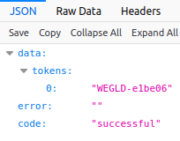
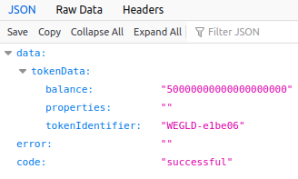
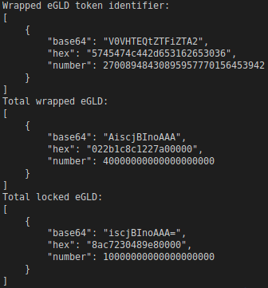
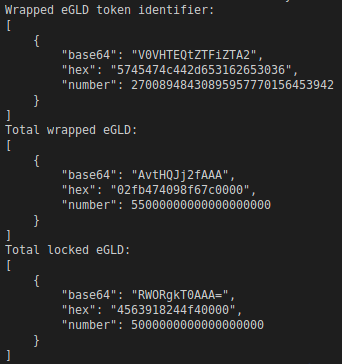
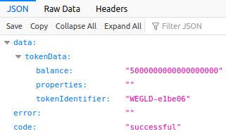

# Testing cheatsheet

CombinedSnippets is used to test the 3 contracts. To test, use the "Run Contract Snippet" option in Elrond VSCode extension.

Just a note: If at any point you get a transaction in "Pending" status, that means there is a nonce mismatch for Alice's account. Check her nonce (address: erd1qyu5wthldzr8wx5c9ucg8kjagg0jfs53s8nr3zpz3hypefsdd8ssycr6th) and make sure it is the same as the value you have stored in the file `erdpy.data-storage.json`. If they're different, update the value in the file to reflect the real nonce value.

First, we need to deploy the contracts and perform additional setup. Call the following functions in this order. Keep in mind that most snippets have a delay of up to one minute, so make sure to wait until the command is fully executed before running the next one.

`1) deployAndSetupBlockHeaderSync`  
`2) deployCrossChainManagement`  
`3) deployEsdtTokenManager`  

IMPORTANT!!! Once the last deploy is complete, you should see something similar to this:
```
Wrapped eGLD token identifier:
[
    {
        "base64": "V0VHTEQtZTFiZTA2",
        "hex": "5745474c442d653162653036",
        "number": 27008948430895957770156453942
    }
]
```

If you don't get this, then that means something went wrong.

If you did indeed get something like this, copy the "hex" number, and update the `WRAPPED_EGLD_TOKEN_IDENTIFIER` variable, which is right at the top of `CombinedSnippets/interaction/snippets.sh` file. Make sure you also add a "0x" in front. After that, it should look like this:

`WRAPPED_EGLD_TOKEN_IDENTIFIER=0x5745474c442d653162653036`

Once this is done, it's time to finalize the setup. You can do that by calling: (this sets the EsdtTokenManager address, adds Wrapped eGLD to the token whitelist and adds Alice to the approved addresses list)

`4) finalizeSetup`

Once this is complete, check everything is in order by going to (replace with the actual address)
`http://localhost:7950/address/*ESDT_TOKEN_MANAGER_ADDRESS*/esdt`

You should see something like this:



Copy the token name and add it to the previous url, like this:
`http://localhost:7950/address/*ESDT_TOKEN_MANAGER_ADDRESS*/esdt/*TOKEN_IDENTIFIER*`

Example:
`http://localhost:7950/address/erd1qqqqqqqqqqqqqpgqlrc2xeqt2a0f9vy5y0xdkvkuds3enmkgd8ssjfgpuj/esdt/WEGLD-e1be06`

You should see something like this:



# Optional Steps

The setup is now complete! You can optionally also test the mint and burn functionalities. Both of the following mint and respectively burn 10 wrapped eGLD (keep in mind we're working with 10^18 values for 1 wrapped eGLD).

`mintMoreWrappedEgld`  
`burnWrappedEgld`

To check if it worked, you can call the following query:

`queryEsdtTokenManager`

# Test Scenario 1

Scenario is as follows:
1) Alice wraps 10 eGLD
2) Alice unwraps 5 eGLD
3) Alice sends the remaining 5 wrapped eGLD to an offchain account

First step is done by calling the following snippet function:

`wrapTenEgld`

After its execution, you should see something like this:



As you may notice, we now have only 40 wrapped eGLD in the contract, but we have 10 locked eGLD.

NOTE: After this, I minted 10 more eGLD in the contract, mostly to prove that order of mint/wrap/unwrap/burn doesn't matter, so take that into account if values seem wrong. You may also mint 10 more here, but it's not necessary.

Second step is to unwrap 5 eGLD. Call `unwrapFiveEgld` and you should see: 



Now the contract has 55 wrapped eGLD and only 5 locked eGLD. And Alice has only 5 wrapped eGLD left:



Now for the final step, Alice sends her remaining 5 wrapped eGLD to an offchain account. For the sake of the example, we're going to send it to the chain with id "10" and we're sending it to the very same address (In practice, addresses are never going to be the same, but for the sake of simplicity, we'll use the same address).

To see the transaction, call `getNextPendingCrossChainTransation` (or alternatively `getTransactionByHash`, the hash is hardcoded in the test). If you call the former, you should see the following:


Looking at the `data` field, "6f6b" means "ok", so the endpoint call worked. Next is the actual transaction. Keep in mind the endpoint returns an `Option<Transaction>`, so that means the leading "01" should be ignored, as it corresponds to the `Option::Some(T)` enum value. To see the transaction's fields, you can go into the `common/tests/deserialize.rs` file and run the `deserialize_transaction` test (the serialized transaction is already in the "input" variable) and you should get this:


To check the payment is saved, call `getPaymentForTransaction`. As before, you can go to `common/tests/deserialize.rs` and run the `deserialize_esdt_payment` test to see the payment data.

And that concludes the first scenario.
